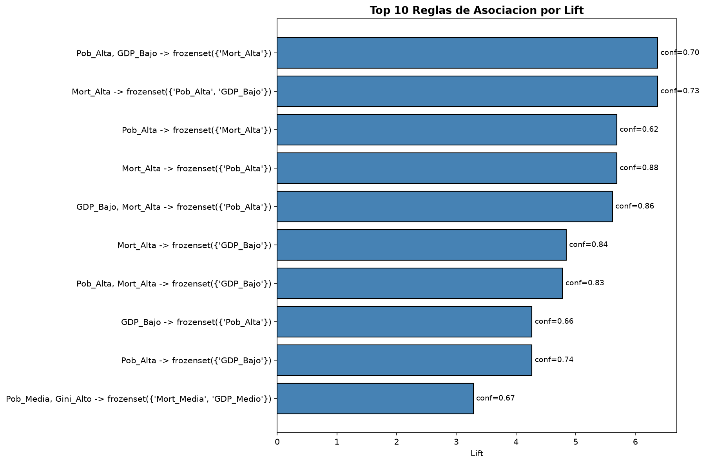
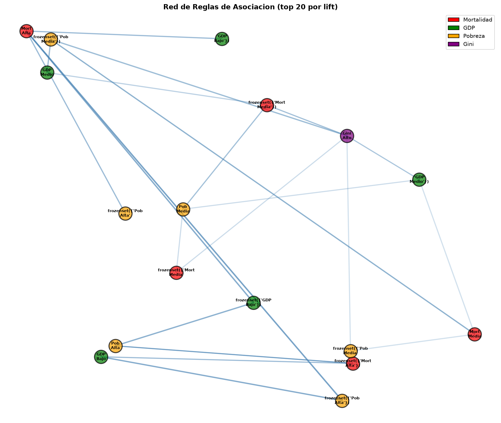
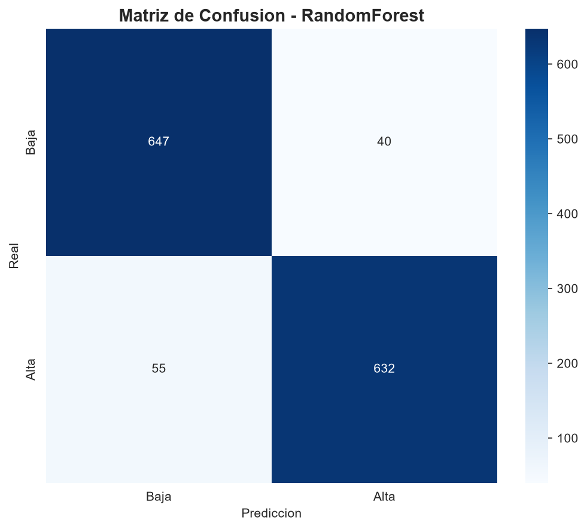
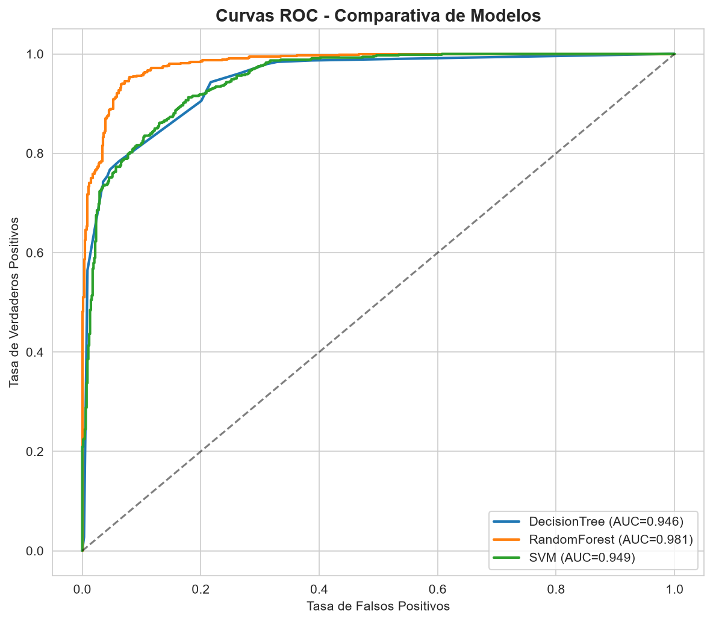

# 🌍 Reto 4 — Data Mining aplicado a la Pobreza Infantil

[](https://www.python.org/)
[](https://scikit-learn.org/)
[](https://pandas.pydata.org/)
[](https://numpy.org/)
[](https://matplotlib.org/)
[](https://seaborn.pydata.org/)
[](http://rasbt.github.io/mlxtend/)
[](https://imbalanced-learn.org/)
[](LICENSE)
[]()

> **Análisis avanzado de pobreza infantil en 217 países combinando clasificación, clustering y reglas de asociación para generar recomendaciones de política pública basadas en datos.**

---

## 📖 Descripción

Este proyecto aplica **técnicas avanzadas de Data Mining** sobre un dataset combinado del **Banco Mundial y UNICEF** (14.105 registros, 217 países, 1960-2024) para:

1. **Predecir** qué países tienen alta mortalidad infantil
2. **Segmentar** países por perfil socioeconómico
3. **Descubrir** reglas de asociación entre indicadores
4. **Generar** recomendaciones accionables para políticas públicas

Proyecto desarrollado como parte del módulo **BI y Big Data — Nivel 5** (Odisea Data).

---

## 🎯 Resultados principales

| Técnica | Algoritmo | Métrica | Valor |
|---|---|---|---|
| 🎯 **Clasificación** | Random Forest | F1-Score | **0,9301** |
| 🔵 **Clustering** | K-means (K=2) | Silueta | **0,5370** |
| 🔗 **Asociación** | FP-Growth | Lift máximo | **6,37** |

### 🔑 Los 3 hallazgos clave

1. **El PIB per cápita es el predictor #1** (44,9% de importancia) de la mortalidad infantil alta.
2. **Dos clusters claramente separados**: 82% desarrollo relativo vs 18% situación crítica.
3. **La trampa de la pobreza es cuantificable**: PIB bajo + Pobreza alta → Mortalidad alta (lift = 6,37).

---

## 📊 Dataset

| Atributo | Valor |
|---|---|
| **Fuente** | [World Bank Open Data](https://data.worldbank.org/) + [UNICEF Data](https://data.unicef.org/) |
| **Archivo** | `world_bank_gdp_data_with_poverty.xlsx` |
| **Registros** | 14.105 (país × año) |
| **Países** | 217 |
| **Columnas** | 64 (económicas, fiscales, pobreza, mortalidad, nutrición) |
| **Periodo** | 1960–2024 |

---

## 🔬 Metodología

### 1️⃣ Clasificación

Predicción binaria de `high_child_mortality` usando:

- **Árbol de Decisión** (interpretabilidad)
- **Random Forest** 🥇 (ganador: F1 = 0,93)
- **SVM** (kernel RBF)

**Features clave**: PIB per cápita, bajo peso al nacer, pobreza extrema.

### 2️⃣ Clustering

Segmentación con **K-means**, **DBSCAN** y **clustering jerárquico**.

- **K óptimo**: 2 clusters (método del codo + silueta)

### 3️⃣ Asociación

Reglas con **Apriori** y **FP-Growth** (soporte ≥ 5%, confianza ≥ 60%, lift > 1,1).

- **Resultado**: 85 reglas, siendo la más fuerte `GDP_Bajo + Pob_Alta → Mort_Alta`

---

## 📁 Estructura del proyecto

```
reto4_pobreza_infantil/
│
├── data/
│   ├── raw/                              # Dataset original
│   │   └── world_bank_gdp_data_with_poverty.xlsx
│   └── processed/                        # Datos limpios y resultados
│       ├── df_clasificacion.csv
│       ├── df_clustering.csv
│       ├── hallazgos_clave.csv
│       ├── paises_con_cluster.csv
│       ├── perfiles_clusters.csv
│       ├── recomendaciones.csv
│       ├── reglas_asociacion.csv
│       ├── resultados_clasificacion.csv
│       ├── resultados_clustering.csv
│       └── resultados_completos.xlsx
│
├── models/                               # Modelos entrenados (.pkl)
│   ├── mejor_modelo_clasificacion.pkl
│   └── kmeans_clustering.pkl
│
├── reports/
│   ├── figures/                          # 18 visualizaciones PNG
│   └── final/                            # Entregables finales
│       ├── Informe_Tecnico_Reto4_jdthg.md / .html / .pdf
│       ├── Recomendaciones_Reto4_jdthg.md / .html / .pdf
│       ├── Presentacion-Reto-4-Data-Mining-aplicado-a-Pobreza-Infantil.pptx
│       └── Reto4_DataMining_PobrezaInfantil_jdthg.tar.gz
│
├── src/                                  # Pipeline completo en Python
│   ├── 01_exploracion.py
│   ├── 02_diagnostico.py
│   ├── 03_preparacion.py
│   ├── 04_clasificacion.py
│   ├── 05_clustering.py
│   ├── 06_asociacion.py
│   ├── 06b_visualizaciones_asociacion.py
│   ├── 07_evaluacion_interpretacion.py
│   ├── 08_recomendaciones.py
│   ├── 09_informe_tecnico.py
│   ├── 12_mapa_mundial.py
│   ├── 13_grafico_cobertura.py
│   ├── 10_generar_html.sh
│   ├── 10_generar_informes.sh
│   ├── 10_generar_pdfs.sh
│   ├── 11_empaquetar.sh
│   └── config.py
│
├── requirements.txt
├── LICENSE
└── README.md
```

---

## 🚀 Instalación y uso

### Requisitos previos

- **Python 3.11+**
- **pip**
- **Git**
- **Pandoc** y **wkhtmltopdf** (solo si quieres regenerar los PDF)

### Instalación

```bash
git clone https://github.com/jdthgp27/Reto-4-Data-Mining-aplicado-a-Pobreza-Infantil.git
cd Reto-4-Data-Mining-aplicado-a-Pobreza-Infantil

python -m venv .venv
source .venv/Scripts/activate    # Windows (Git Bash)
# source .venv/bin/activate      # macOS / Linux

pip install -r requirements.txt
```

### Ejecución del pipeline completo

```bash
python src/01_exploracion.py
python src/02_diagnostico.py
python src/03_preparacion.py
python src/04_clasificacion.py
python src/05_clustering.py
python src/06_asociacion.py
python src/06b_visualizaciones_asociacion.py
python src/07_evaluacion_interpretacion.py
python src/08_recomendaciones.py
python src/09_informe_tecnico.py
python src/12_mapa_mundial.py
python src/13_grafico_cobertura.py
```

### Generar los informes finales (HTML/PDF)

```bash
bash src/10_generar_html.sh
bash src/10_generar_pdfs.sh
bash src/11_empaquetar.sh
```

---

## 📸 Visualizaciones destacadas

### Dashboard final


### Matriz de correlaciones


### Importancia de features (Random Forest)


### Segmentación de países (PCA)


### Mapa mundial de pobreza infantil


### Reglas de asociación





### Matriz de confusión



### Curva ROC



> **15+ visualizaciones completas** en `reports/figures/`

---

## 💡 Recomendaciones de negocio

| # | Recomendación | Aplicación |
|---|---|---|
| **R1** | **Países con desarrollo relativo** | Programas de prevención temprana |
| **R2** | **Países en situación crítica** | Intervención humanitaria integral |
| **R3** | **Sistema de alerta temprana** | Basado en PIB bajo + pobreza alta |
| **R4** | **Optimización presupuestaria** | Priorizar desarrollo económico |
| **R5** | **Monitoreo continuo** | Pipeline predictivo anual |

📄 Detalles completos en [Recomendaciones_Reto4_jdthg.pdf](reports/final/Recomendaciones_Reto4_jdthg.pdf)

---

## 🛠️ Tecnologías utilizadas

<p align="center">
  
  
  
  
  
  
  
</p>

| Categoría | Herramientas |
|---|---|
| **Lenguaje** | Python 3.13 |
| **Datos** | pandas, NumPy, OpenPyXL |
| **ML** | scikit-learn, imbalanced-learn |
| **Reglas de asociación** | MLxtend (Apriori, FP-Growth) |
| **Visualización** | Matplotlib, Seaborn |
| **Documentación** | Pandoc, wkhtmltopdf |

---

## 📚 Documentación

| Documento | Enlace |
|---|---|
| 📄 **Informe Técnico completo (PDF)** | [Ver informe](reports/final/Informe_Tecnico_Reto4_jdthg.pdf) |
| 📝 **Informe Técnico (MD)** | [Ver informe](reports/final/Informe_Tecnico_Reto4_jdthg.md) |
| 🌐 **Informe Técnico (HTML)** | [Ver informe](reports/final/Informe_Tecnico_Reto4_jdthg.html) |
| 💼 **Recomendaciones de negocio (PDF)** | [Ver recomendaciones](reports/final/Recomendaciones_Reto4_jdthg.pdf) |
| 🎤 **Presentación PowerPoint** | [Ver presentación](reports/final/Presentacion-Reto-4-Data-Mining-aplicado-a-Pobreza-Infantil.pptx) |
| 📦 **Paquete completo (tar.gz)** | [Descargar](reports/final/Reto4_DataMining_PobrezaInfantil_jdthg.tar.gz) |

---

## ⚠️ Limitaciones

1. **Cobertura limitada de variables de pobreza infantil** (~0,5%).
2. Se usó `under5_mortality_rate` como **proxy** (cobertura 82%).
3. **Correlación ≠ causalidad**: los hallazgos son asociaciones estadísticas, no relaciones causales.
4. **Requiere reentrenamiento anual** por deriva de datos.

---

## 🔄 Próximas mejoras

- [ ] Añadir datos más recientes (2025+)
- [ ] Incorporar variables cualitativas (índice de desarrollo humano, gobernanza)
- [ ] Análisis temporal de la evolución por país
- [ ] Modelos de series temporales (SARIMA, Prophet)
- [ ] Dashboard interactivo con Streamlit o Power BI
- [ ] API REST para consulta de predicciones

---

## 👤 Autora

**Judit Giravent Pineda**

- Business Analytics Student | Odisea Data
- GitHub: [@jdthgp27](https://github.com/jdthgp27)
- LinkedIn: [linkedin.com/in/judit-giravent-27b167156](https://linkedin.com/in/judit-giravent-27b167156)
- Email: jdthgp27@gmail.com

---

## 📜 Licencia

MIT License — ver [LICENSE](LICENSE) para más detalles.

---

## 🙏 Agradecimientos

- [UNICEF Data](https://data.unicef.org/)
- [World Bank Open Data](https://data.worldbank.org/)
- [Odisea Data](https://odiseadata.com/) — Programa de formación

---

⭐ Si este proyecto te resulta útil, ¡dale una estrella!