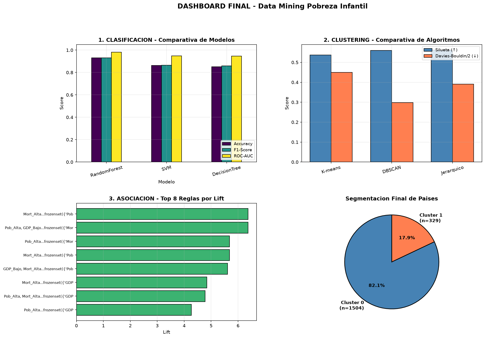
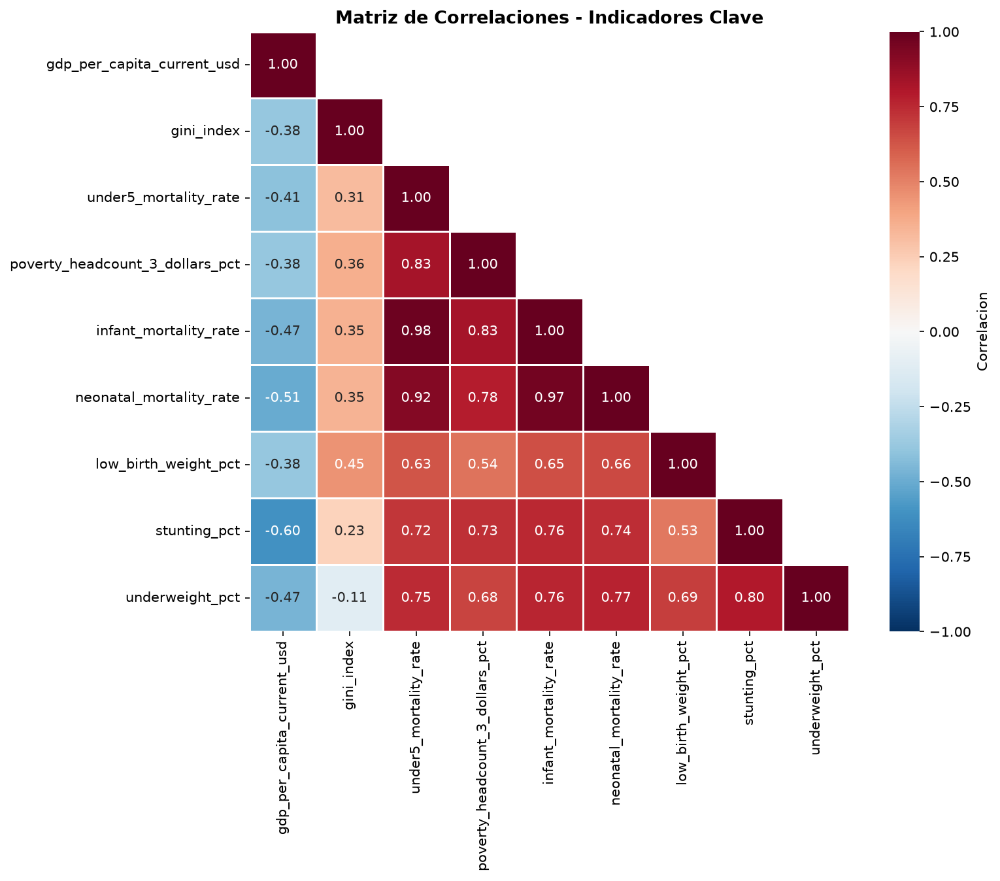
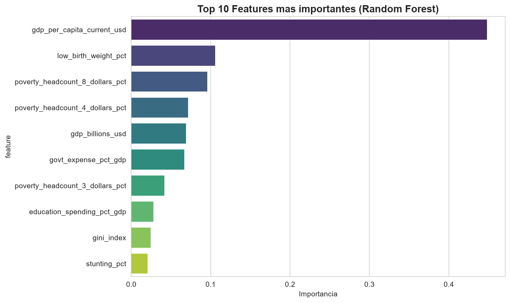
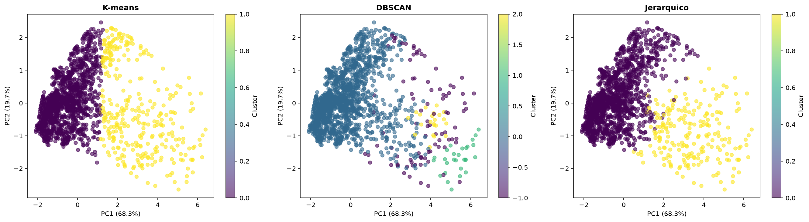
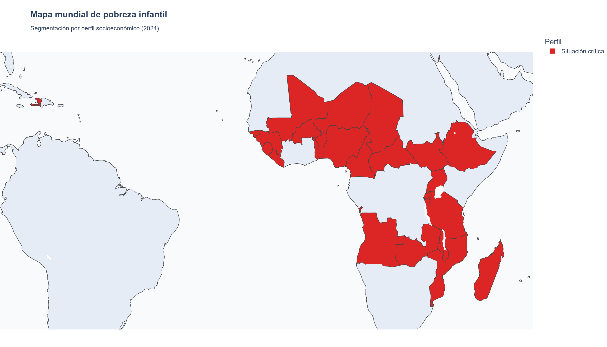

# 🌍 Reto 4: Data Mining aplicado a la Pobreza Infantil

> **Análisis avanzado de pobreza infantil en 217 países combinando clasificación, clustering y reglas de asociación para generar recomendaciones de política pública basadas en datos.**

[](https://www.python.org/)
[](https://scikit-learn.org/)
[](https://pandas.pydata.org/)
[](LICENSE)

---

## 📖 Descripción

Este proyecto aplica **técnicas avanzadas de Data Mining** sobre un dataset combinado del **Banco Mundial y UNICEF** (14.105 registros, 217 países, 1960-2024) para:

1. **Predecir** qué países tienen alta mortalidad infantil
2. **Segmentar** países por perfil socioeconómico
3. **Descubrir** reglas de asociación entre indicadores
4. **Generar** recomendaciones accionables para políticas públicas

Proyecto desarrollado como parte del módulo **BI y Big Data - Nivel 5** (Odisea Data).

---

## 🎯 Resultados principales

| Técnica | Algoritmo | Métrica | Valor |
|---------|-----------|---------|-------|
| 🎯 **Clasificación** | Random Forest | F1-Score | **0.9301** |
| 🔵 **Clustering** | K-means (K=2) | Silueta | **0.5370** |
| 🔗 **Asociación** | FP-Growth | Lift máximo | **6.37** |

### 🔑 Los 3 hallazgos clave

1. **El PIB per cápita es el predictor #1** (44.9% de importancia) de la mortalidad infantil alta
2. **Dos clusters claramente separados:** 82% desarrollo relativo vs 18% situación crítica
3. **La trampa de la pobreza es cuantificable:** PIB bajo + Pobreza alta → Mortalidad alta (lift=6.37)

---

## 📂 Estructura del proyecto
```text
reto4_pobreza_infantil/
│
├── data/
│ ├── raw/ # Dataset original (Banco Mundial + UNICEF)
│ └── processed/ # Datos limpios y resultados
│
├── models/ # Modelos entrenados (.pkl)
│ ├── mejor_modelo_clasificacion.pkl
│ └── kmeans_clustering.pkl
│
├── reports/
│ ├── figures/ # 15 visualizaciones PNG
│ └── final/ # Informes finales (MD/HTML/PDF)
│
├── src/ # Pipeline completo en Python
│ ├── 01_exploracion.py
│ ├── 02_diagnostico.py
│ ├── 03_preparacion.py
│ ├── 04_clasificacion.py
│ ├── 05_clustering.py
│ ├── 06_asociacion.py
│ ├── 07_evaluacion_interpretacion.py
│ ├── 08_recomendaciones.py
│ └── 09_informe_tecnico.py
│
├── requirements.txt
└── README.md
```


---

## 🚀 Instalación y uso

### Requisitos previos

- Python 3.11+
- pip
- Git

### Instalación

```bash
git clone https://github.com/jdthgp27/Reto-4-Data-Mining-aplicado-a-Pobreza-Infantil.git
cd Reto-4-Data-Mining-aplicado-a-Pobreza-Infantil

python -m venv .venv
source .venv/Scripts/activate    # Windows (Git Bash)
pip install -r requirements.txt
Ejecución del pipeline completo
bash
python src/01_exploracion.py
python src/02_diagnostico.py
python src/03_preparacion.py
python src/04_clasificacion.py
python src/05_clustering.py
python src/06_asociacion.py
python src/07_evaluacion_interpretacion.py
python src/08_recomendaciones.py
python src/09_informe_tecnico.py
```

### 📊 Dataset

Fuente: world-bank-unicef-data

Archivo principal: world_bank_gdp_data_with_poverty.xlsx

Origen: Banco Mundial + UNICEF

Características
14.105 registros (país × año)

217 países representados

64 columnas (económicas, fiscales, pobreza, mortalidad, nutrición)

Periodo: 1960-2024

### 🔬 Metodología

1️⃣ Clasificación
Predicción binaria de high_child_mortality usando:

Árbol de Decisión (interpretabilidad)

Random Forest (ganador: F1=0.93)

SVM (kernel RBF)

Features clave: PIB per cápita, bajo peso al nacer, pobreza extrema

2️⃣ Clustering
Segmentación con K-means, DBSCAN y clustering jerárquico.

K óptimo: 2 clusters (método del codo + silueta)

3️⃣ Asociación
Reglas con Apriori y FP-Growth (soporte ≥ 5%, confianza ≥ 60%, lift > 1.1).

Resultado: 85 reglas, siendo la más fuerte GDP_Bajo + Pob_Alta → Mort_Alta

### 📈 Visualizaciones destacadas

### Dashboard final


### Matriz de correlaciones


### Importancia de features


### Segmentación de países


### Mapa mundial de pobreza infantil


*(15 visualizaciones completas en `reports/figures/`)*

### 💡 Recomendaciones de negocio

R1 - Países con desarrollo relativo: Programas de prevención temprana

R2 - Países en situación crítica: Intervención humanitaria integral

R3 - Sistema de alerta temprana: Basado en PIB bajo + pobreza alta

R4 - Optimización presupuestaria: Priorizar desarrollo económico

R5 - Monitoreo continuo: Pipeline predictivo anual

📄 Detalles en reports/final/Recomendaciones_Reto4_jdthg.pdf

### 🛠️ Tecnologías utilizadas

Categoría	Herramientas
Lenguaje	Python 3.13
Datos	Pandas, NumPy, OpenPyXL
ML	Scikit-learn, Imbalanced-learn
Reglas de asociación	MLxtend
Visualización	Matplotlib, Seaborn
Documentación	Pandoc, wkhtmltopdf

### 📚 Documentación
- 📄 [Informe Técnico completo](reports/final/Informe_Tecnico_Reto4_jdthg.pdf)
- 💼 [Recomendaciones de negocio](reports/final/Recomendaciones_Reto4_jdthg.pdf)
- 🎤 [Presentación PowerPoint](reports/final/Presentacion-Reto-4-Data-Mining-aplicado-a-Pobreza-Infantil.pptx)

### ⚠️ Limitaciones

Cobertura limitada de variables de pobreza infantil (~0.5%)

Se usó under5_mortality_rate como proxy (cobertura 82%)

Correlación ≠ causalidad

Requiere reentrenamiento anual por deriva de datos

### 📜 Licencia
MIT License - ver LICENSE para más detalles.

👤 Autor
jdthgp27

Proyecto del módulo BI y Big Data - Nivel 5

⭐ Si este proyecto te resulta útil, ¡dale una estrella!

### 🙏 Agradecimientos
UNICEF Data

World Bank Open Data

Odisea Data - Programa de formación
